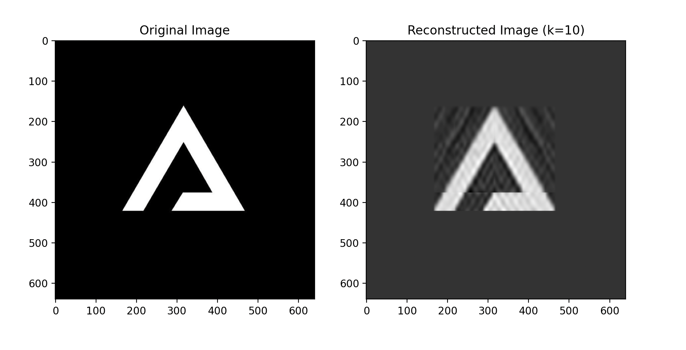

# SVD преобразование для изображения



# 🚀 Get started
- **Установка пакетного менеджера poetry (если еще не установлен)**
[Ссылка на инструкцию по установке](https://python-poetry.org/docs/#installation)

- **Установка зависимостей**
```shell
poetry install
```

- **Запуск проекта**
```shell
poetry run main
```